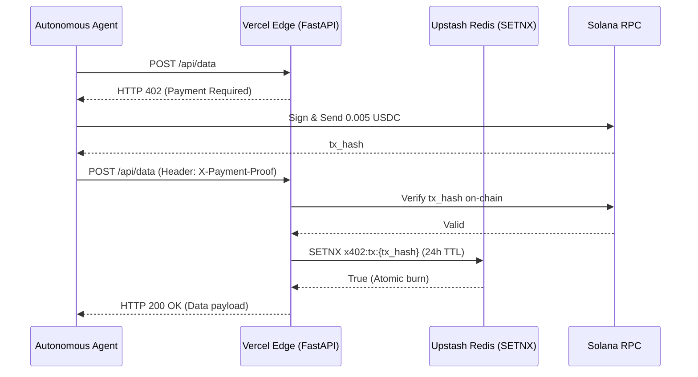

# x402 Vercel Gateway

A production-ready reference implementation for protecting FastAPI endpoints with the `HTTP 402 Payment Required` (x402) protocol on Vercel serverless environments.

## The "Why"
Autonomous AI agents (AutoGPT, LangChain, MCP tools) cannot fill out credit card forms or hold Stripe accounts. To monetize agent-to-agent (A2A) API calls, developers must rely on programmatic crypto micro-transactions. The x402 protocol provides a standardized challenge-response mechanism for this.

## Architecture

## The Hard Problem Solved: Ephemeral State
When deploying payment gateways to Vercel or AWS Lambda, the compute layer is stateless. A standard Python dictionary (`{tx_hash: time}`) cannot protect against **Replay Attacks** because every new request might spin up a cold isolated micro-VM.

A malicious actor could pay 0.005 USDC once, and blast your API with 10,000 requests using the same `tx_hash`. Because each Vercel instance has an empty dictionary, they will all validate the transaction, draining your upstream API credits.

**This gateway solves this using Upstash Redis.** By calling `SETNX` (Set if Not eXists), we achieve an atomic, distributed burn of the transaction hash. Even if 50 Vercel instances cold-start simultaneously, only the first instance will successfully acquire the lock. The remaining 49 will reject the request.

## Setup
1. Deploy to Vercel.
2. Provision an Upstash Redis database.
3. Bind `UPSTASH_REDIS_REST_URL` to your Vercel environment.
