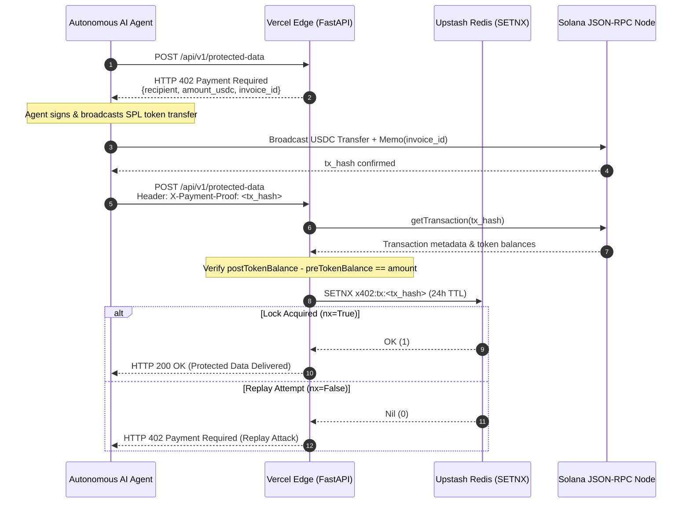

# ⚡ x402 Vercel Gateway

[](https://fastapi.tiangolo.com)
[](https://solana.com)
[](https://vercel.com)
[](https://upstash.com)
[](https://opensource.org/licenses/MIT)

> **A production-ready reference implementation for protecting FastAPI endpoints with the `HTTP 402 Payment Required` (x402) protocol on serverless infrastructure.**

---

## 💡 The Problem: The Agent Friction Wall

Autonomous AI agents (via AutoGPT, LangChain, MCP, or custom bots) cannot fill out credit card forms or complete 2FA challenges. As agent-to-agent (A2A) economic interactions grow, APIs need a machine-native monetization standard.

The **x402 protocol** leverages standard HTTP error codes combined with cryptographic micro-transactions (Solana USDC / EVM) to challenge callers for payment before serving protected compute or data.

---

## 🚨 The Fatal Flaw: Ephemeral State in Serverless

Most developers protect their gateway using an in-memory dictionary or local cache to track spent transaction hashes:

```python
# ❌ THE VULNERABILITY (Works in Docker, fails on Serverless)
_burned_hashes = {}
if tx_hash in _burned_hashes:
    raise HTTPException(status_code=402, detail="Replay Attack")
_burned_hashes[tx_hash] = True
```

**Why this breaks:**
On serverless platforms (Vercel, AWS Lambda), compute is stateless and horizontally ephemeral. If an attacker pays 0.005 USDC once and sends 10,000 concurrent requests with the identical `tx_hash`, Vercel spins up dozens of cold micro-VMs. **Every single instance starts with an empty dictionary.** All 10,000 requests pass validation, draining your upstream LLM or database quotas while you only get paid once.

---

## 🛡️ The Solution: Atomic Distributed State + On-Chain Proof

This gateway resolves the serverless state dilemma through a two-phase cryptographic & atomic protocol:

1. **On-Chain Delta Verification:** We query Solana JSON-RPC (`getTransaction` with `jsonParsed`) to mathematically prove that the target Associated Token Account (ATA) received the exact payment by computing `postTokenBalances - preTokenBalances`.
2. **Atomic Distributed Lock (`SETNX`):** We leverage Upstash Redis with the `SETNX` (Set if Not eXists) command to achieve a globally atomic burn of the transaction hash across all serverless regions.

```python
# ✅ THE FIX: Verify On-Chain, then Burn Globally
is_valid = await verify_solana_transaction(tx_hash, required_memo=invoice_id)
if not is_valid:
    raise HTTPException(status_code=402, detail="Invalid payment proof")

# Atomic lock across all serverless cold starts (24h TTL)
acquired = redis_client.set(f"x402:tx:{tx_hash}", current_time, ex=86400, nx=True)
if not acquired:
    raise HTTPException(status_code=402, detail="Replay Attack Detected")
```

---

## 📐 Architecture



---

## 🚀 Quickstart

### 1. Clone & Install
```bash
git clone https://github.com/roblambert9/x402-vercel-gateway.git
cd x402-vercel-gateway
python -m venv .venv
source .venv/bin/activate  # Or: .venv\Scripts\activate on Windows
pip install -r requirements.txt
```

### 2. Configure Environment Variables
Create a `.env` file or set in your Vercel Dashboard:

| Variable | Description | Example |
| :--- | :--- | :--- |
| `SOLANA_RPC_URL` | Solana JSON-RPC endpoint | `https://api.devnet.solana.com` |
| `RECIPIENT_WALLET` | Your receiving Solana address | `YourWalletPublicKey...` |
| `USDC_MINT_ADDRESS`| Mint address for USDC | Devnet: `4zMMC9srt5Ri5X14GAgXhaHii3GnPAEERYPJgZJDncDU` |
| `UPSTASH_REDIS_REST_URL` | Upstash Redis REST URL | `https://your-db.upstash.io` |
| `UPSTASH_REDIS_REST_TOKEN` | Upstash Redis REST Token | `AXxxxx...` |

### 3. Run Locally
```bash
uvicorn main:app --reload --port 8000
```

### 4. Run Live-Fire Integration Test
To run an automated test that signs and broadcasts a real SPL transfer on Devnet and verifies the gateway's 402 challenge response:
```bash
python tests/live_fire_devnet.py
```

---

## 📦 Deployment to Vercel

```bash
vercel --prod
```

Ensure your Upstash Redis integration is bound to your Vercel project environment variables.

---

## 📄 License

MIT License — free to use and integrate into your own agentic services. Built by [Rob Lambert](https://github.com/roblambert9).
